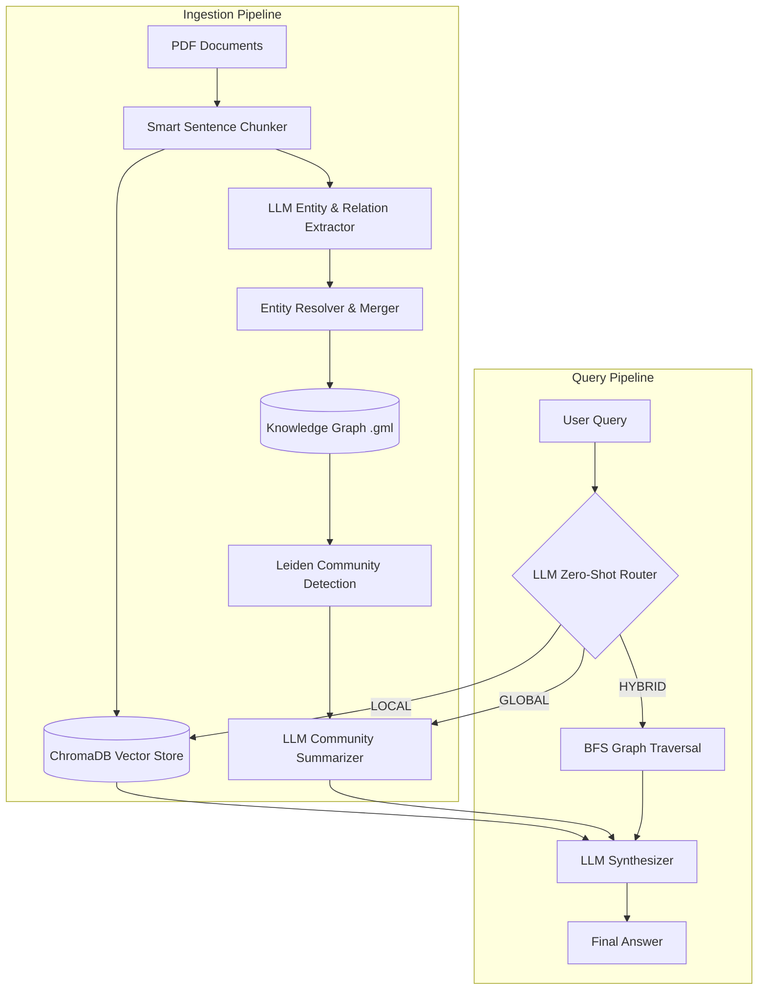

# GraphRAG — Graph-Based Retrieval-Augmented Generation

> A knowledge-graph-powered RAG system that answers both factual and thematic questions over multi-document corpora.

## Overview
Standard Vector RAG is excellent at retrieving specific facts, but it struggles with "global" synthesis questions that require connecting themes across an entire dataset. **GraphRAG** solves this by building a semantic Knowledge Graph from your documents.

This project implements a hybrid architecture that combines:
1. **Vector Search (Local)** for precision fact-finding.
2. **Community Map-Reduce (Global)** for high-level thematic synthesis.
3. **Graph Traversal (Hybrid)** for multi-hop reasoning across entities.

## Architecture



## Key Results (LLM-as-a-Judge Evaluation)

We evaluated this GraphRAG implementation against a Vanilla RAG baseline using an LLM-as-a-Judge (Claude Haiku). The evaluation tested both Global (synthesis) and Local (fact-finding) queries.

| Metric | Vanilla RAG | GraphRAG | 
|--------|-------------|----------|
| **Comprehensiveness** (Global Queries) | 30.7% | **69.3%** |
| **Diversity** (Global Queries) | 41.3% | **49.3%** |
| **Directness** (Local Queries) | **96.0%** | 4.0% |

*Conclusion: The router effectively leverages Vector RAG for direct factual lookups, while GraphRAG heavily outperforms on comprehensive thematic synthesis.*

## Project Structure

```
graphrag/
├── src/                      # Core modules
│   ├── graph_builder.py      # LLM graph extraction and gleaning
│   ├── entity_resolver.py    # Semantic entity deduplication
│   ├── community_detection.py# Leiden graph clustering
│   ├── graph_query.py        # Map-Reduce over communities
│   ├── router.py             # LLM query intent classifier
│   └── ...                   
├── scripts/                  # CLI tools
│   ├── build_graph.py        # Builds graph from chunks
│   ├── ingest_documents.py   # Chunks PDFs and builds vector index
│   └── run_evaluation.py     # Runs automated RAG vs GraphRAG evals
├── config.yaml               # Centralized configuration
├── app.py                    # Streamlit UI
└── tests/                    # Unit tests
```

## Quick Start

### 1. Install Dependencies
```bash
pip install -r requirements.txt
```

### 2. Configure API Keys
Create a `.env` file based on `.env.template`:
```env
# Example .env
CLAUDE_API_KEY=your_key_here
GEMINI_API_KEY=your_key_here
LLM_PROVIDER=ollama
```

### 3. Run the Pipeline
```bash
# Step 1: Chunk PDFs and build Vector Store
python scripts/ingest_documents.py --pdf-dir data/raw

# Step 2: Build the Knowledge Graph
python scripts/build_graph.py --input data/processed/chunks.json

# Step 3: Run the Evaluation or start the UI
python scripts/run_evaluation.py
streamlit run app.py
```

## Tech Stack
- **Graph Processing:** NetworkX, Leidenalg, Graspologic
- **Vector Store:** ChromaDB
- **LLM Integration:** Anthropic (Claude), Google GenAI (Gemini), Groq, Ollama
- **UI:** Streamlit, Vis.js
